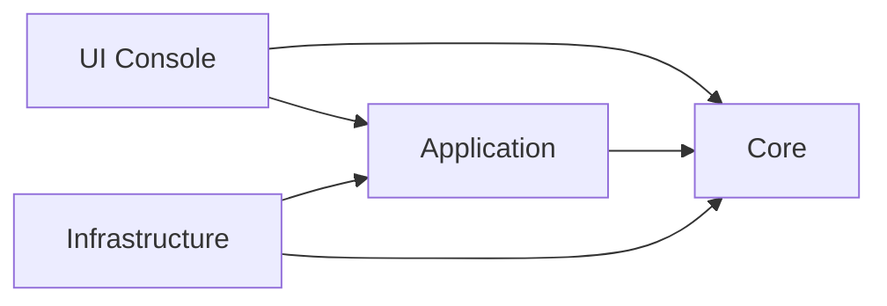

# Eternal Realms CLI Architecture

## Dependencias por capas

- `EternalRealms.Core`
  - Contiene el modelo de dominio: entidades, objetos de valor, enumeraciones, eventos, excepciones y servicios de negocio.
  - No depende de ninguna otra capa del sistema.

- `EternalRealms.Application`
  - Contiene lógica de casos de uso: comandos, handlers, DTOs, validadores e interfaces que implementa Infrastructure.
  - Depende de `EternalRealms.Core`.

- `EternalRealms.Infrastructure`
  - Implementa repositorios, serialización JSON, persistencia en archivos y logging.
  - Depende de `EternalRealms.Application` e `EternalRealms.Core`.

- `EternalRealms.UI.Console`
  - Contiene la interfaz de usuario basada en Spectre.Console.
  - Depende de `EternalRealms.Application` y `EternalRealms.Core`.
  - No debe acceder directamente a la lógica de Infrastructure fuera del ensamblador de dependencias en `Program.cs`.

## Diagrama de dependencias

## Modelo de dominio principal

### Entidades

- `Character`
- `Enemy`
- `Inventory`
- `Equipment`
- `Quest`
- `Item`, `Weapon`, `Armor`, `Consumable`
- `LootTable`

### Objetos de valor

- `Stats`
- `Health`
- `Mana`
- `Damage`
- `Reward`
- `Experience`
- `Gold`

### Servicios de dominio

- `CombatService`
- `LootService`
- `QuestService`
- `LevelService`

### Arquitectura por capas

- Core: reglas de negocio, modelo de dominio, eventos y excepciones.
- Application: orquestación de casos de uso, validación y DTOs.
- Infrastructure: implementación de persistencia y servicios técnicos.
- UI: capa de presentación que consume casos de uso.

## Enfoque SOLID y Clean Architecture

- Single Responsibility: cada clase cumple una sola responsabilidad.
- Open/Closed: los servicios y repositorios se pueden extender sin modificar el código existente.
- Liskov Replacement: las abstracciones de repositorio y servicios permiten reemplazo seguro.
- Interface Segregation: interfaces pequeñas y específicas para cada caso de uso.
- Dependency Inversion: las capas superiores dependen de abstracciones definidas en Application/Core.

## Por qué existe cada proyecto

- `EternalRealms.Core`: dominio puro, reglas del juego y objetos de negocio.
- `EternalRealms.Application`: casos de uso, validaciones y contratos.
- `EternalRealms.Infrastructure`: puente con IO y almacenamiento.
- `EternalRealms.UI.Console`: experiencia de usuario y menús interactivos.

## Composición de dependencias

El ensamblaje de dependencias se realizará en `Program.cs`. Ahí se registrarán las implementaciones de `ICharacterRepository`, `IQuestRepository`, `ISaveGameRepository`, `ILogger`, `IFileStorageService`, `IJsonSerializerService` y el bus de eventos.
